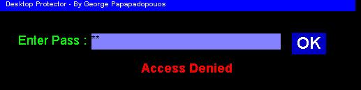



## A Good Desktop Protector \(updated\)

### Description

When Desktop Protector is activated,it disable all the function keys ( ALT+TAB , ALT+CTRL+DELETE , ALFT+F4 , CTRL+ESCAPE ..... ) and freezes the mouse in the middle of the form...the updated version also hides it from ALL windows OS and set the priority to Realtime for so windows won't allow to close the program...the only way to unlock you windows is to enter the password...if you type the wrong password a msg "Access Denied" appeares and don't leave unless you enter the right password so when you come back to your pc..you can see if anyone tried to unlock it behind your back :).The program also denies to close unless you enter the right password..this is to prevent other programs to close it ..and give access to your pc....( THIS CODE DOESN'T WORK SO WELL FOR WINDOWS XP/NT/200 ).....Have Fun :)
 
### More Info
 

             |
---                |---
**Submitted On**   |2002-08-25 17:56:08
**By**             |[George Papadopoulos  \- VirusFree](https://github.com/Planet-Source-Code/PSCIndex/blob/master/ByAuthor/george-papadopoulos-virusfree.md)
**Level**          |Beginner
**User Rating**    |4.9 (44 globes from 9 users)
**Compatibility**  |VB 5\.0, VB 6\.0
**Category**       |[Miscellaneous](https://github.com/Planet-Source-Code/PSCIndex/blob/master/ByCategory/miscellaneous__1-1.md)
**World**          |[Visual Basic](https://github.com/Planet-Source-Code/PSCIndex/blob/master/ByWorld/visual-basic.md)
**Archive File**   |[A\_Good\_Des989206262002\.zip](https://github.com/Planet-Source-Code/george-papadopoulos-virusfree-a-good-desktop-protector-updated__1-36125/archive/master.zip)

